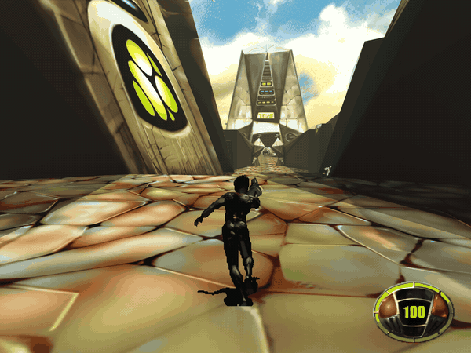
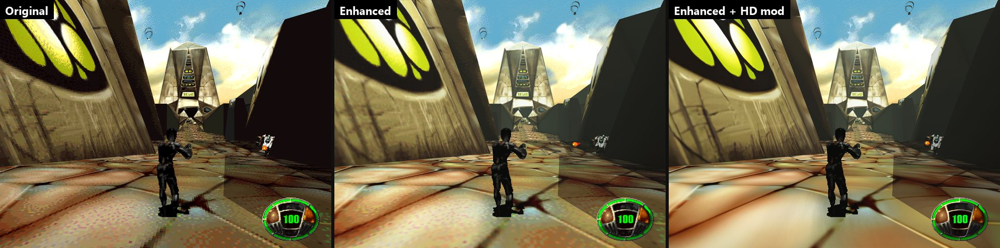
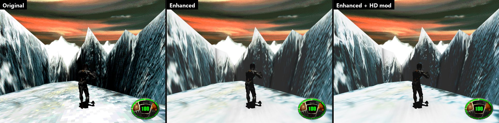
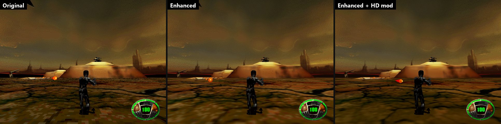
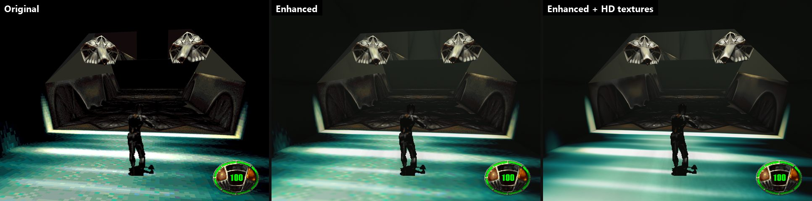
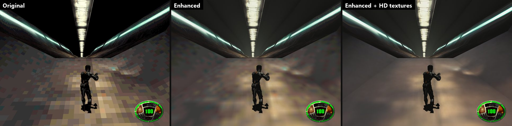
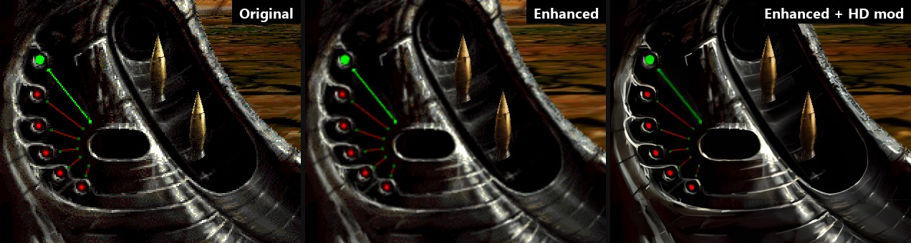

# MDK in C# and SDL3


[](https://github.com/nemo22/mdk-sdl/releases)




A port of [MDK](https://en.wikipedia.org/wiki/MDK_(video_game)) (Shiny Entertainment, 1997) to
C# on [SDL3](https://libsdl.org/). It's the successor of the Godot port
[mdk-godot](https://github.com/nemo22/mdk-godot) and reuses its reverse engineering of the
original game's data files and executable (`MDKD3D.EXE`). Instead of Godot's renderer and physics
it renders and collides like the original: Kurt moves through the arenas' BSP trees with the
original's box sweeps.

> [!IMPORTANT]
> **You need the original game to play.** This port contains no data from MDK: no levels,
> textures, models, sounds, music or videos. It reads them at run time from your own installed
> copy of the original game (available for example on GOG). Without the original game data the
> port won't run.

## Features

- **Stereo 3D (optional)**: side by side, crossview, row-interlaced, interlaced-reversed, top and
  bottom and reversed top and bottom, with real eye separation and convergence
  ([below](#stereo-3d)).
- **The whole game**: every level, the fall before it and the stream after it, rides, menus,
  briefings, statistics, saves, the end movies. Plays like the original (its BSP collisions,
  scripts and sound laws, reverse engineered).
- **HD textures (optional)**: Options, Mods, "Make HD textures" upscales the game's textures and HUD 2x
  with the AI upscaler [Real-ESRGAN](https://github.com/xinntao/Real-ESRGAN), locally on your GPU,
  from your copy of the game, into a mod (Options, Mods switches it). Nothing upscaled is
  distributed. [Details](#hd-textures).
- **Modding**: replace textures, the HUD and menus' images, fonts and models (glTF) in the
  enhanced look; `--export-assets` writes the originals to start from. [docs/modding.md](docs/modding.md).
- **Enhanced look (optional)**: filtered textures, each level lit from its sky (sun and shadows
  outdoors), dynamic lights of muzzle flashes, explosions and fires, ambient occlusion, glow, haze,
  anti-aliasing. The original look stays pixel-exact.
- **Windows, Linux, macOS and Android** (touch controls; [notes](#android)).
- Quick save and load (F2, F9), a developer console and overlay, cheats.

[Downloads](https://github.com/nemo22/mdk-sdl/releases): `mdk-win-x64.zip`, `mdk-linux-x64.tar.gz`,
`mdk-osx-arm64.zip`, `mdk-android.apk`. They need the original game's data (GOG, Steam or CD;
[below](#running)).

## Stereo 3D

Contributed by [agrofubris](https://github.com/agrofubris) ([#2](https://github.com/nemo22/mdk-sdl/pull/2)).

A stereo renderer draws each frame twice, once through each eye's camera, and composites for the
display. The eyes are parallel; their images meet at the **convergence** distance (0 parallax
there), nearer things come out of the screen and the sky stays at infinity (its panorama uses the
eye's own frustum, so it keeps the full eye separation's disparity).

- **Modes**
  - `sbs` — side by side: the left eye in the left half (3D TVs, VR cinema players).
  - `crossview` — side by side with the halves exchanged, for crossed free viewing.
  - `int` — row-interlaced: even rows the left eye (row-interleaved/passive 3D displays and
    shutter glasses).
  - `intr` — row-interlaced the other way: even rows the right eye (displays whose rows start
    with the other eye).
  - `tab` — top and bottom (over-under): the left eye in the top half.
  - `tabr` — top and bottom with the halves exchanged: the right eye in the top half.
- **Options, 3D Stereo** (main menu and pause menu): Mode, Separation (the eyes' distance apart,
  in the game's units) and Convergence (the distance their images meet at; at the most, `far`:
  parallel rays, meeting at infinity). Left/Right change them and, held, keep stepping; the
  settings apply at once and are saved (`settings.cfg`: `stereo`, `stereo_separation`,
  `stereo_convergence`).
- **Console**: `stereo off|sbs|crossview|int|intr|tab|tabr [separation] [convergence]` (saved).
- **Command line** (tests, not saved): `--stereo=off|sbs|crossview|int|intr|tab|tabr`,
  `--stereo-separation=0.25`, `--stereo-convergence=10`.

Notes: the scene is rasterized twice, so stereo costs more GPU time (fine on a discrete GPU even
with the enhanced look and the HD textures). Row-interlacing is drawn 1:1 with the window: keep
the window at the display's native resolution (and 100% scaling) on a row-interleaved display.
The menus, the HUD and the videos are drawn whole in both eyes (zero parallax), so they stay
readable.

## Screenshots

Original | enhanced | enhanced with the HD textures mod (click for full size).








## Status

**Beta.** The whole game can be played through and has been playtested level by level; please report bugs (with the console's `pos` output). Every level loads, Kurt walks it and the level scripts run:
aliens spawn, walk and fly their paths, doors open, pickups fall on their chutes. Kurt fires his
chain gun, throws his items, gets hurt, knocked down and dies, and the HUD shows his health,
inventory, messages and the target's health bar. Aliens blow up into pieces, sparks fly, slime
bleeds and the fans lift Kurt. He grabs ledges and climbs them, slides down level 6's wind
tunnels on his back, gets hurt by hard landings and dies falling out of the arena; the camera
rolls, shakes and pushes him away from the walls behind him. He snipes through the scope with every kind of round and calls
Bones' air strike. Only Kurt's arena and the one behind an open door are drawn and solid, as in
the original; doors move into Kurt's arena, so they open from either side, and a teleport into
a corridor loads the arena behind it.
The game starts with the splash and the main menu (options, key bindings, saved
games) and plays the levels in order with their loading screens, briefings, the end of each level,
the statistics and the save prompt; when Kurt dies, "Continue" starts the level again. After each
level Kurt steers down the stream's tube until Bones' crane picks him up (after LEVEL8 he follows
Gunter to the planet). Before each level he falls from orbit onto the minecrawler, dodging the
radars' missiles and catching pickups. Kurt rides level 4's snowboard and level 7's walker
(`XD2`) and bomber (`XE`), the end of a level tears the arena apart around him as he rises, F2
makes a full save of the level, and the Score-O-matic spins its heads. Each arena plays its music with
the original's fades, scripts animate textures, switch the sky and film cutscenes, sniper rounds
leave bullet holes, and ropes, twisters' ribbons and the glass panes' outlines are drawn. An
enhanced look (Options, Graphics) filters the textures, lights each arena from its level's sky
(a sun and its shadows outdoors), lights muzzle flashes, explosions and fires, and adds ambient
occlusion, a little glow and a haze, and can draw AI-upscaled textures made from your copy of the
game ([HD textures](#hd-textures)); anti-aliasing smooths the edges. The three
levels of the 1996 beta demo play as extras ([below](#the-1996-beta-demo)). The game can be played
through. The [Godot port](https://github.com/nemo22/mdk-godot) is no longer developed.

## Progress

| Area | Done |
| --- | --- |
| Data formats: levels, textures, models, sprites, sounds, fonts, scripts, videos | █████████░ 95% |
| Rendering: arenas, glass, sky, mirrors, Kurt's sprite, effects | █████████░ 95% |
| Enhanced look: filtering, mipmaps, sky light and shadows, point lights, occlusion, glow, haze, HD textures; anti-aliasing | █████████░ 85% |
| Collisions: the original's BSP | █████████░ 95% |
| Kurt: walking, turning, jumping, chute, ledges, slides, camera, damage, death | █████████░ 95% |
| Sound mixer (the original's laws) and music | █████████░ 90% |
| Script VM, aliens, objects, doors, effects, fans | █████████░ 90% |
| Weapons, items, sniper mode | █████████░ 90% |
| HUD (health, inventory, messages, health bar) | █████████░ 90% |
| Menus, saves, level flow | █████████░ 90% |
| The fall and the stream between levels, rides | █████████░ 90% |
| Videos: the menu's FLC and slideshow, the end movies | █████████░ 90% |
| Dev tools: console, F3 overlay, cheats, quick save/load | █████████░ 90% |
| Mods: textures, 2D images, fonts, models (glTF), export | ████████░░ 80% |
| Playtesting and bug fixing (every level played through) | ████████░░ 80% |
| Android: APK, data import, touch controls (runs on a phone; controls to tune) | ███████░░░ 75% |
| **Overall** | **about 92%** |

Recently added: modding (textures, 2D images, fonts, glTF models), HD textures as a mod with the
HUD upscaled too, the Android app, per-level sky light and shadows, dynamic lights.

The plan is in [docs/architecture.md](docs/architecture.md#roadmap).

## Running

Windows x64, Linux x64 and macOS (Apple silicon): one executable each, `mdk.exe` or `mdk` (see
[Building](#building)). It is played on Windows; the Linux and macOS builds are only built and
started on CI so far. Put the program (or this folder) inside the MDK installation folder (for
example `C:\GOG Games\MDK\mdk-sdl`), install MDK in the default GOG or Steam location, or set the
`MDK_DATA_DIR` environment variable, or name the folder in a file `mdk_paths.cfg` next to the
program:

```
[paths]
mdk="C:/GOG Games/MDK"
beta="C:/Games/MDK (1996-08-06) (beta demo)"
```

On Linux and macOS copy the installed game's folder (from
Windows, Wine or the GOG installer); file names match whatever their case. macOS keeps a downloaded
program in quarantine: `xattr -d com.apple.quarantine mdk`.

```
mdk.exe
```

- No option: the splash, then the main menu.
- `--level=N`: play level N (3 to 8) at once, without the menu (the game plays them in the order
  7, 6, 3, 4, 8, 5); 961, 963 and 966 are the 1996 demo's.
- `--menu`: the main menu without the splash (`--splash` with it); `--options`, `--controls`,
  `--beta-levels` open those pages.
- `--stats=N`: the screens after level N (`--phase=1-4` starts at a page: 1 the Score-O-matic, 2
  the intermission, 3 the briefing, 4 the debriefing; `--counts=shots,hits,sniper,sniper
  hits,kills,enemies,heads`, `--towns=bits`); `--briefing=N` its briefing alone; `--end` the end
  movies.
- `--fall=N`: the fall before level N, then the level (`--profile` prints it every second,
  `--walk=seconds` holds "forward" from `--delay=seconds` of fall).
- `--stream=N`: the stream after level N (`--health=N` Kurt's health; its tube is always the same
  one, for tests).
- `--load=NAME`: load a saved game (a full save prints its hash); `--save=NAME`: save the first
  level when it starts; `--snapshot=NAME`: a full save (as F2) at the screenshot, its hash printed
  (tests).
- `--at=x,y,z[,yaw]`: where Kurt starts (MDK coordinates).
- `--fly`: start with the flying camera.
- `--mute`: no sound.
- `--enhanced`, `--original`: the enhanced or the original look instead of the settings' (not
  saved).
- `--upscale-textures[=3,7]`: make the enhanced look's HD textures, then quit ([below](#hd-textures)).
- `--export-assets=dir`: write the game's textures, 2D images (PNG) and models (glTF .glb) into
  `dir` for modding, then quit ([docs/modding.md](docs/modding.md)).
- `--mod=a,b`: only these mods (folders of `mods/`) for this run (not saved).
- `--bloodyes`, `--nobloodno`: gore on or off instead of the settings' (not saved; the original's
  `-bloodyes`, `-nobloodno`).
- `--gpu=d3d12|vulkan|metal|auto`: the GPU backend instead of the settings' (not saved).
- Tests: `--screenshot=file.bmp` (after `--wait=seconds` of game time, then quit),
  `--walk=seconds`, `--delay=seconds` (held keys start later), `--jump`, `--fire`, `--give=SW_HBOMB,...` (pickups to start with), `--use`
  (uses the item after 1 second), `--profile` (prints the objects of Kurt's arena every second),
  `--trace` (prints Kurt, the camera and what carries him every frame),
  `--sniper[=zoom[,pitch]]` (sniper mode once Kurt stands), `--zoom=seconds` (zooms in),
  `--sniper-fire` (one sniper round), `--strike[=dive]` (Bones' full-screen strike), `--die` (Kurt
  dies after 1 second), `--event=N` (a `special_event` after 1 second: 1 ends the level). After
  `--delay`: `--teleport=ARENA,x,y,z`, `--kill=TYPE` (kills the first object of that type),
  `--ride=TYPE` (Kurt on that walker), `--bomber[=drop]` (level 7: calls the `XE`, boards it, and
  with `drop` drops a bomb once unlocked), `--beta-teleport=N` (the 1996 demo's teleport N),
  `--roll=left|right` (holds a roll of the demo's levels). `--console="pos;god"` opens the
  console and runs those commands, on any first screen (`--menu --console="map 6"`). With
  `--screenshot` but without `--level`, the screen shown after `--wait` seconds (menu,
  statistics...) is saved. `--soak[=seed]`: random but seeded keys on every screen (menu keys
  too when it starts in the menus), 0.1 s a frame; in a level Kurt is healed and problems print
  as `Soak problem` (`--tour`: every arena in turn during `--wait`, doors shut before each teleport).
  `--press=QuickSave@1,Menu.Accept@1.5`: presses game keys, or menu keys after `Menu.`, once at
  those times. `--frames=dir,count[,every]`: after `--wait`, saves every Nth frame of a level (4:
  15 a second) as `frame000.bmp`..., then quits (the animation above).

Settings (the options below, the mods' switches) and saved games
are kept next to the executable (`settings.cfg`, `saves/*.sav`; `MDK_USER_DIR` overrides the
folder). The first run copies them from where older builds kept them (`%LOCALAPPDATA%/mdk-sdl`). `LASTGAME` (written when Kurt dies) is deleted at start, as in the original.

### Options

From the main menu or the pause menu; a page per kind, each change applied and saved at once
(`settings.cfg`), Esc goes up a page.

- **Display**: display mode (windowed, fullscreen on the desktop, exclusive fullscreen in a mode of
  the display's own), resolution (window sizes that fit the display; the display's modes, each
  at its highest refresh rate), render scale (50-200 % of the window's size: faster or
  supersampled; the HUD too), VSync (on; off: may tear; adaptive: SDL_GPU's mailbox, no tearing,
  the newest frame shown; falls back to what the display supports), frame limit (60, 120, 144 a
  second with VSync off or adaptive) and GPU backend (Auto, Direct3D 12 or Vulkan on Windows,
  Vulkan on Linux, Metal on macOS; after a restart; a backend that fails falls back to Auto).
  Android has render scale, VSync and frame limit (always fullscreen, Vulkan).
- **Graphics**: the original or the enhanced look, anti-aliasing, gore.
- **3D Stereo**: the stereo layout, the eyes' separation and convergence ([above](#stereo-3d)).
- **Audio**: master, music and effects volumes, the music filter.
- **Controls**: mouse sensitivity and inversion, key bindings.
- **Game**: difficulty.
- **Mods**: each mod on or off, "Make HD textures" (desktop), "Import from folder" (Android).

At start the log (and the console) names the build, the GPU and its backend, the display and the
frame (sizes, formats, MSAA, present mode; again when they change) and the look; F3 shows them too:

```
MDK SDL 1.0.0-beta.1 | .NET 10.0.12 Native AOT | SDL 3.5.0
GPU: NVIDIA GeForce RTX 3060 (Vulkan via SDL_GPU), driver 616.56.0.0
Look: Enhanced, mods: hd-textures
Display: 3440x1440 @ 144 Hz, window 1280x960 (windowed), render target 1280x960, swapchain B8G8R8A8_UNORM (8 bits per channel, SDR), depth D32_FLOAT, MSAA 4x, present mode VSYNC
```

Controls: W/S or Up/Down to run, A/D to strafe, the mouse or Left/Right to turn, Space to jump
(hold it while falling to open the chute; running into a ledge while falling grabs it), Shift for turbo, Ctrl or the left mouse button to fire,
Enter or E to use the item, Tab, [ ] or the mouse wheel to select it (or 1-5), the right mouse button for sniper mode
(the mouse wheel or PageUp/PageDown zoom, Tab or [ ] select the ammo), F1 for the flying camera (E/Q to go up and
down), F2 for a quick save (the original's full save: the name is asked, the level's number
offered), F9 for a quick load (this session's last F2 save, else the newest save; "Nothing to
load" if none), F3 for the debug overlay, the key left of 1 for the console, F12 for a screenshot, Esc for the pause menu (resume, options, main menu, quit; it names the quick keys). Saving
and loading show "Game saved", "Game loaded" or "Can't save now" (sniper mode, rides) on the HUD;
outside a level the quick keys do nothing. The bindings
can be changed in Options, Controls (to any key, mouse button or wheel direction). In the menus: the arrows or the mouse, Enter or a click, Esc
back; the mouse cursor is the original's arrow. Typing `TOOSCARYFORME` in a level turns gore on or
off for the session, `SEETHEWHOLEGAME` the main menu's debug keys (3-8 start that level, F the fall before LEVEL8,
S the stream after LEVEL7, D the statistics with random counts).

### HD textures

The enhanced look can draw the textures upscaled 2x by an AI upscaler, made once on your computer
from your copy of the game: Options, Mods, "Make HD textures" (a progress page; leaving it cancels), or
`mdk --upscale-textures` (all levels; `=3,7` only those; `--hd-model=general|anime`,
`--hd-scale=2|4`). They are a mod, `mods/hd-textures/` ([docs/modding.md](docs/modding.md)):
Options, Mods, "HD textures (Real-ESRGAN)" switches them, from the next level on (enhanced look
only; the original look is unchanged). Other mods override them.

- Downloaded once into `tools/realesrgan/` next to the program: the portable
  [Real-ESRGAN](https://github.com/xinntao/Real-ESRGAN) release v0.2.5.0
  (`realesrgan-ncnn-vulkan-20220424-<windows|ubuntu|macos>.zip`, about 45 MB, from GitHub;
  through WinHTTP on Windows, libcurl on Linux and macOS), its SHA-256 checked. If the release moves, set its archive and checksum in `settings.cfg`:
  `upscaler_url=` (https, file URL or local path) and `upscaler_sha256=`; empty means the
  default. A new checksum installs it again. Real-ESRGAN and its models: BSD 3-Clause
  (Xintao Wang); the ncnn-Vulkan executable: MIT; ncnn: BSD 3-Clause (Tencent).
- Needs a Vulkan GPU (integrated ones work, slower). There is no CPU fallback: it would take hours.
- Made: `mods/hd-textures/textures/LEVELn/<NAME>@<key>.png` (2D images in `images/`), `mod.txt`
  and `manifest.txt` next to the program. Each image is the texture as an arena's palette shows
  it, its key a hash of that (size, indices, colours): a changed or other game file never gets a
  stale image. Run again, it keeps what is still current and makes the rest. An older build's
  `textures-hd/` is moved into the mod at start or when they're made.
- Upscaled: arenas, corridors, the objects' models (each texture once per distinct palette),
  Kurt's sprite in the levels (407 frames, shared by all levels: 50 s, 27 MB on disk), and the 2D
  images: the HUD, sniper mode's screen, the bomber's sight, the falls' HUD, the main menu's and
  the loading screens' pictures (drawn at the window's resolution). Kept original: the fonts
  (upscaled, they blur; a mod can replace them), the sky, effects' sprites, the statistics, the
  fall's and the stream's 3D views; a texture a sniper round marks with a bullet hole goes back to
  the original.
- Cut-outs keep hard edges: the upscaler gets the colour only (clear texels filled with their
  neighbours' colour, the frame wrapped around by 8 texels so tiling textures stay seamless); the
  alpha is the original's, upscaled bilinear and cut at half cover. Kurt's frames keep that alpha
  soft: the shader cuts their outline at half cover as smoothly as the original's.
- Cost (default: x4plus, 2x): all six levels in about 4 minutes on an RTX 3060 (the anime
  model: seconds), 243 MB on disk; a level's upscaled textures take 4 times the GPU memory
  (LEVEL3: 40 MB to 160 MB; 195 MB with Kurt, sprites and effects); 4x would be 16 times (about
  640 MB for LEVEL3), too much for smaller GPUs. Loading a level takes about a second longer.
- x4plus sharpens edges, cracks and painted shapes, but smooths fine grain away (lava, noisy
  floors); animevideov3 keeps more grain, with more ringing. Judge for yourself.
- Nothing from the game is in this repository or its releases: the images stay on your computer.
- Not made on Android (the upscaler is desktop-only): make them on a PC and copy `mods`
  into the phone's MDK folder ([below](#android)).

### Console and debug overlay

On every screen (menus, briefing, statistics, videos, loading, the fall, the stream, a level),
F3 shows the debug overlay (its text made 4 times a second): frames per second and the frame's
time (scene, render, physics, scripts, audio), draw calls, triangles and the time the frame waited
for the GPU (in a window, render includes waiting for the display's refresh: vsync), memory (GC
heap, working set, collections), then the screen's
own lines: a menu's name; the fall's time, Kurt's height, health and pickups; the stream's
segment, speed and health; in a level Kurt's position, yaw and state, the level, his arena and
the objects. The key left of 1 (`` ` ``, `;` on a Slovak keyboard) opens the console: the game's
output above a command line (Tab completes a command, Up/Down the history, PageUp/PageDown
scroll, Esc closes). The screen runs on, without the keys. Outside a level `tp`, `pos`, `give`,
`health`, `kill` and `save` answer "Not in a level"; `god`, `noclip` and `onehit` hold from the next level;
`map` starts a level from the menus.

| Command | |
| --- | --- |
| `map <level> [arena]` | play a level, from a floor of that arena |
| `teleport`, `tp <x y z \| arena [x y z]>` | move Kurt (`tp HMO_4`, `tp 1 2 3`, `tp HMO_4,1,2,3`) |
| `pos` | where Kurt is, as `--level`, `--at`, `--teleport` and `--console` options |
| `noclip`, `god` | fly through everything (Space up, Q down); no damage |
| `onehit` | Enemies die in one hit (guns, sniper rounds, blasts, items, air strike); puzzle objects (LEVEL8's forklift and XEARTH), scenery and shatterable walls take normal damage |
| `give all`, `give <SW_...>` | pickups (`give SW_HBOMB`) |
| `health <n>`, `kill` | Kurt's health; kill the enemies of his arena |
| `save <slot>`, `load <slot>` | a full save (as F2), a saved game |
| `difficulty <easy\|normal\|hard>`, `look <original\|enhanced>`, `aa <off\|2x\|4x>` | settings (saved; the look reloads the level) |
| `timescale <x>` | game time faster or slower (0 to 10) |
| `mods` | the mods (on/off, priority); in a level, the images and models they replaced |
| `fps`, `help`, `clear`, `quit` | the overlay, the commands, clear the log, quit |

### The 1996 beta demo

`MDKDEMO.EXE` of 6 August 1996, a non-interactive DOS demo, has three levels in earlier versions of
the game's formats: the city (961), `HMO_1` (963) and `OLYM_1` (966). The port plays them (see the
Godot port's [docs/beta96.md](https://github.com/nemo22/mdk-godot/blob/main/docs/beta96.md)). It
isn't part of the port: you need your own unpacked copy, besides the retail game (menus, fonts and
sprites come from it). Tell the port where it is (the folder with `TRAVERSE` and `MDKDEMO.EXE`):
`beta` in `mdk_paths.cfg` (above), the `MDK_BETA_DIR` environment variable, or a folder `BETA96` or
`MDK (1996-08-06) (beta demo)` in or next to the game's folder or the program's. The main menu then
has a "Beta Levels" page; `--level=961` starts one at once (no briefing, fall or stream). They show
the demo's Kurt and health display; Kurt dies as in the retail game, and no "Continue" is saved.
Their own keys: Z and C roll left and right, T or Alt with a digit takes the demo's teleports (the
city needs T + 4 to reach the top of `ARENA_4`); the sniper key puts the helmet on first.

### Android

`mdk-android.apk` (a release's or CI's artifact) runs on 64-bit Android 8+ phones with Vulkan
(arm64; x64 for emulators). Install it by allowing installs from unknown sources. The game files
aren't in it: copy your MDK folder (the one with `TRAVERSE`, `MISC`, `FALL3D`, `STREAM`) to the
phone, e.g. into `Download/MDK`. On first start the app asks for that folder (Android's folder
picker; `Download` itself can't be picked, a folder in it can) and copies its game files (about
170 MB) into its own folder, `Android/data/io.github.nemo22.mdk/files/mdk`, once. Settings and
saves live next to it, in `files`.

Mods and HD textures: make them on a PC ([above](#hd-textures)), copy the `mods` folder (next to
`mdk.exe`) into the phone's MDK folder, then Options, Mods, "Import from folder" and pick it again: new
or changed files are copied, `mods` too (an older `textures-hd` becomes the HD textures mod).
Options, Mods then switches them (enhanced look).

Touch controls in play: the left part of the screen is a stick where the finger lands (walk,
strafe; far pushes run), dragging elsewhere looks around, buttons on the right fire, jump, use
the item, pick the next item, toggle sniper mode and zoom (+ / -), and pause (top right). Menus
take taps; Android's back button is Esc. A keyboard works as on the desktop.

Not yet: game controllers, typing save names (no on-screen keyboard), the console. Tested on the
Android emulator and one phone.

The APK is signed with a debug key until a release key is set: to update, uninstall the old one
first (that deletes its copy of the game files and the saves; the first start imports again).

Building it needs the Android workload (`dotnet workload install android`), JDK 21 and the
Android SDK's API 36 platform, and SPIR-V shaders (`-p:DxcSpirv=...`):
`dotnet publish src/Mdk.Android -c Release -p:DxcSpirv=path/to/dxc` gives
`src/Mdk.Android/bin/Release/net10.0-android/publish/io.github.nemo22.mdk-Signed.apk`, signed
with a debug key. CI signs with the `ANDROID_KEYSTORE` secret (base64 keystore;
`ANDROID_KEYSTORE_PASS`, `ANDROID_KEY_ALIAS`) when it's set; without it every build has its own
key and an update must be installed after uninstalling the old one (which deletes its copy of the
game files and the saves).

## Building

Needs the .NET 10 SDK and the shader compiler of the platform's GPU API (SDL_GPU):

| Platform | GPU API | Shaders | Tools |
| --- | --- | --- | --- |
| Windows | Direct3D 12 | DXIL | `dxc` of the Windows SDK, or of the [DirectXShaderCompiler release](https://github.com/microsoft/DirectXShaderCompiler/releases) |
| Linux (Windows with `SDL_GPU_DRIVER=vulkan`) | Vulkan | SPIR-V | `dxc` of the DirectXShaderCompiler release or of the [Vulkan SDK](https://vulkan.lunarg.com/sdk/home) |
| macOS | Metal | MSL | `dxc` (SPIR-V) and `spirv-cross` of the Vulkan SDK |

The build compiles every format whose tool runs and skips the others (it prints `Shaders: DXIL
true, SPIR-V false, MSL false`); the program uses the first one its GPU driver takes. The tools are
looked for at the Windows SDK's place (DXIL), in `$VULKAN_SDK/bin`, then on the PATH; or name them:
`-p:Dxc=...` (DXIL), `-p:DxcSpirv=...`, `-p:SpirvCross=...`. `-p:RequiredShaders="spirv msl"` fails
the build without those formats.

```
dotnet build
src/Mdk.App/bin/Debug/net10.0/mdk --level=3
```

One native executable (Native AOT; also needs the Visual Studio C++ tools on Windows, clang and
zlib on Linux, Xcode on macOS): `sh tools/publish.sh [win-x64|linux-x64|osx-arm64|osx-x64]` (this
machine's by default; `publish.bat` on Windows) gives `publish/mdk` or `publish/mdk.exe` (about 5.5 MB) and SDL3's library next to
it (`SDL3.dll`, `libSDL3.so`, `libSDL3.dylib`).

The icon (original artwork, not the game's) is drawn by `python tools/gen_icon.py` (Pillow, numpy):
`assets/icon.svg`, `assets/icon.ico` (the Windows executable's) and `assets/icon.png` (the
window's, embedded in the engine).

GitHub Actions (`.github/workflows/build.yml`) builds and tests every push on Windows, Linux and
macOS and publishes the three executables and the Android APK as the run's artifacts; a `v*` tag
makes a release of them.

## Tests

With the game data installed (without it `dotnet test` skips the tests that read it):

```
dotnet test
sh tests/screenshot_test.sh
sh tests/kurt_test.sh
sh tests/kurt_moves_test.sh
sh tests/combat_test.sh
sh tests/scripts_test.sh
sh tests/sniper_test.sh
sh tests/hud_test.sh
sh tests/palette_test.sh
sh tests/effects_test.sh
sh tests/flow_test.sh
sh tests/stream_test.sh
sh tests/quicksave_test.sh
sh tests/fall_test.sh
sh tests/rides_test.sh
sh tests/carry_test.sh
sh tests/snapshot_test.sh
sh tests/end_level_test.sh
sh tests/visuals_test.sh
sh tests/enhanced_test.sh
sh tests/beta_test.sh
sh tests/console_test.sh
sh tests/mods_test.sh
sh tests/alloc_test.sh
sh tests/soak_test.sh short
```

`tests/soak_test.sh` (about 3 minutes with `short`, 15 without) plays every level, arena, fall,
stream and menu with random keys and reports exceptions, hangs and `Soak problem` lines.
`MDK_REFERENCE=<another build's mdk> sh tests/enhanced_test.sh` also checks that the original look
is that build's, pixel for pixel; `MDK_HD_DIR=<a user folder with mods/hd-textures/>` that HD
textures change the enhanced look and not the original. The upscaler itself isn't run by the tests (it
needs the game's files and a GPU).
`tests/beta_test.sh` and the demo's unit test are skipped without the 1996 demo.
`tests/alloc_test.sh` plays levels hidden with `--perf[=warmup seconds]` (each frame waits for the
GPU; at the end the frames' average times by section, bytes allocated per frame and garbage
collections are printed) and fails above 512 bytes a frame or on a gen 1-2 collection.

## Layout

- `src/Mdk.Formats`: MDK's file formats, no dependencies.
- `src/Mdk.Engine`: SDL3 behind a small API: the renderer (SDL_GPU; stereo in
  `Renderer.Stereo.cs` and `shaders/stereo.hlsl`), the audio mixer, the window and input.
- `src/Mdk.Game`: the game: levels, collisions, Kurt, the camera, the sound mixer's laws, scripts,
  the game's flow (`Flow/`: screens, settings, saves), its menus (`Menu/`), the stream (`Stream/`)
  and the fall (`Fall/`).
- `src/Mdk.App`: the program and its command line.
- `src/Mdk.Android`: the Android app (SDL's activity, the game files' import, its dialogs).
- `shaders/`: HLSL shaders, compiled to DXIL, SPIR-V and MSL at build time (`bindings.hlsli`:
  SDL_GPU's bindings).
- `docs/`: [the architecture and roadmap](docs/architecture.md). The knowledge base about MDK
  itself (formats, engine, scripts, BSP) is in the
  [Godot port's docs](https://github.com/nemo22/mdk-godot/tree/main/docs).
- `tests/`, `tools/`: tests, the opcode table generator and the publish script.
- `.github/workflows/`: CI builds and releases.

## Legal

This is an unofficial fan project, not affiliated with Shiny Entertainment or the current rights
holders of MDK. MDK and its data are the property of their respective owners.

This repository contains only original code, documentation and tools. It doesn't include or
distribute any data from the game. To run the port you need a legally obtained copy of the
original MDK, whose installed data files the port loads.

## Contributors

- [agrofubris](https://github.com/agrofubris): stereo 3D.

## Licence

Copyright © 2026 Marek Draškaba.

This program is free software: you can redistribute it and/or modify it
under the terms of the **GNU General Public License, version 3** as
published by the Free Software Foundation. It is distributed in the hope
that it will be useful, but WITHOUT ANY WARRANTY — without even the
implied warranty of MERCHANTABILITY or FITNESS FOR A PARTICULAR PURPOSE.
See [LICENSE](LICENSE) for the full text.

The licence covers **this port's own code**. It says nothing about the
original game's data, which belongs to its rights holders and is not
distributed here.
